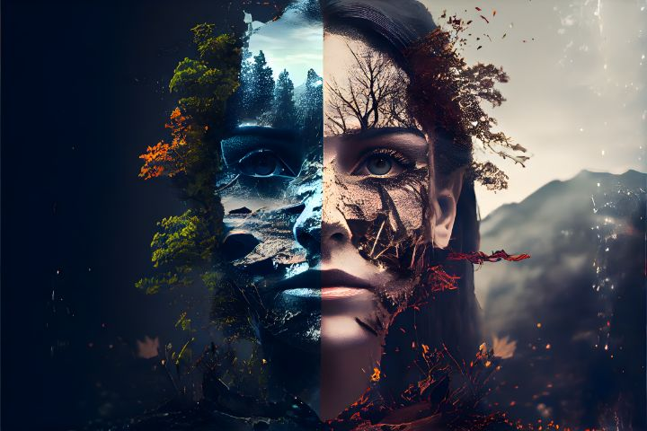
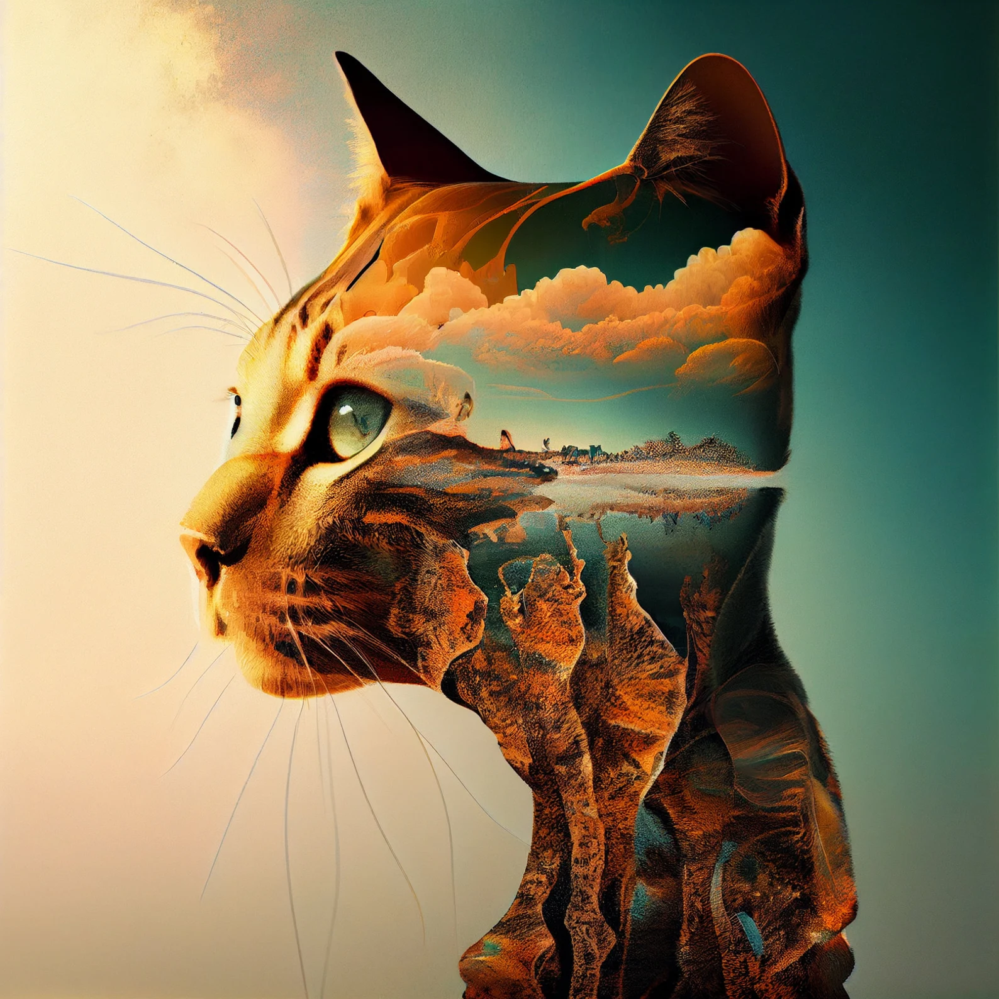

# yzha3003_9103_quiz9

## 1. Imaging Technique Inspiration
> The imaging technique I found is **Double Exposure**. This method overlays two distinct images to create an abstract visual effect. The main image will be the geometric lines and structures of the chosen artwork, while the overlay image will incorporate abstract patterns or natural elements like mountains or trees. I think this technique is beneficial for our assignment because it allows us to represent both structural design and organic forms simultaneously, highlighting contrasts and deeper symbolism. It also provides a unique way to explore the artwork's composition, adding layers of meaning and visual interest.

- 

- 

## 2. Coding Technique Exploration
> To achieve the double exposure effect, I plan to use the P5.js with the `blendMode(SCREEN)` function. The `SCREEN` blending mode inversely multiplies the colour values of two images, resulting in a brighter effect. This method is perfect for merging geometric structures with abstract patterns or natural elements, allowing both images to be visible. 

- 

- [Link to an example implementation](https://p5js.org/reference/p5/blendMode/)